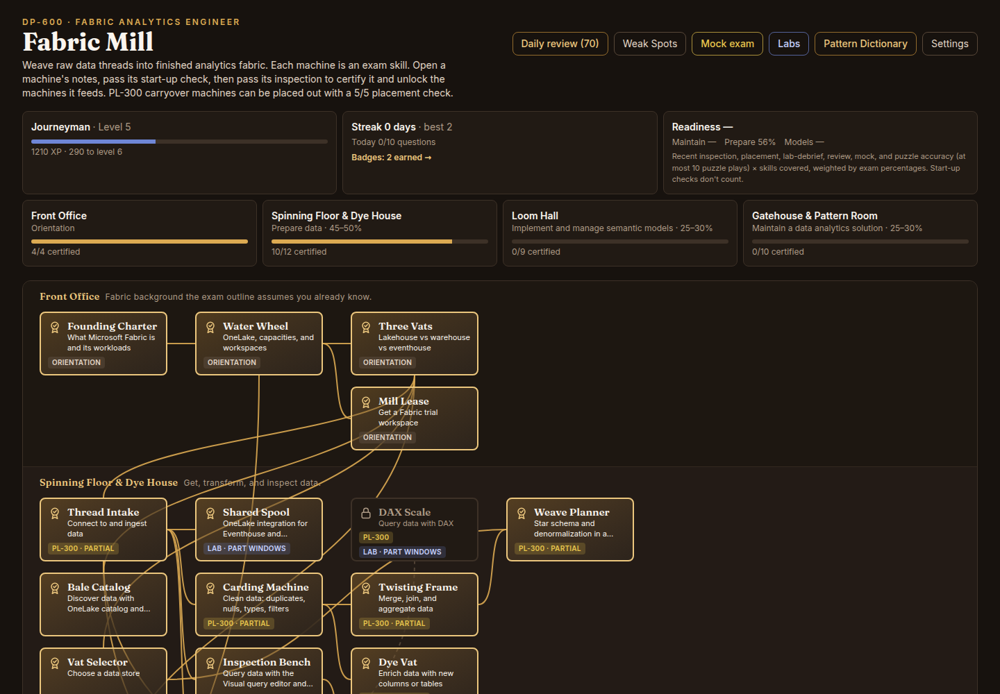
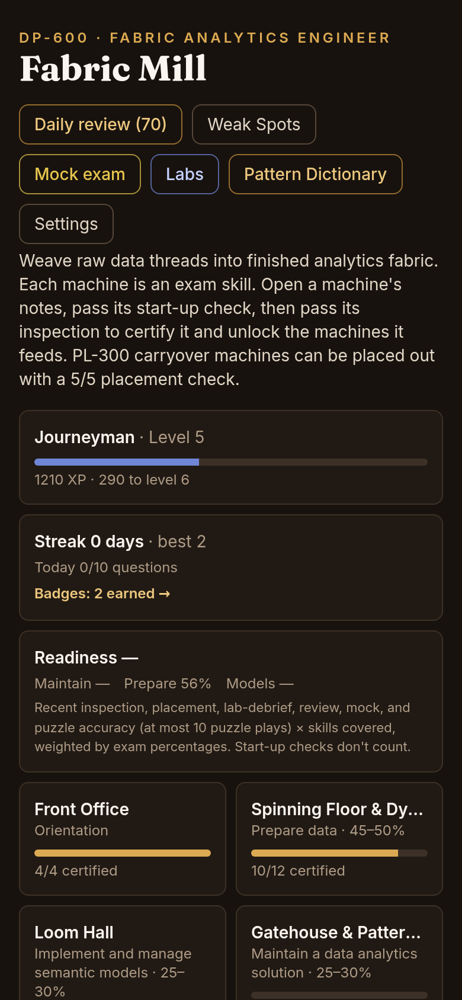
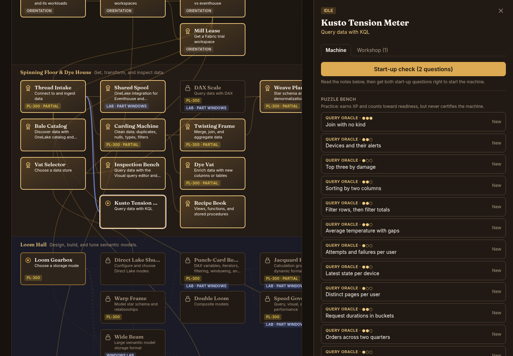
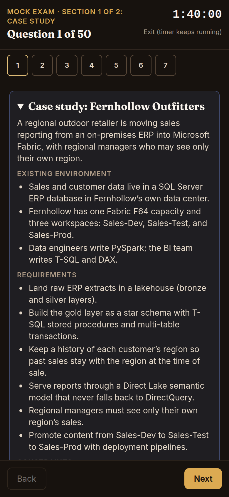

# Fabric Mill

**A study game for Microsoft exam DP-600: Implementing Analytics Solutions Using Microsoft Fabric.**

Live at **https://dp600.edwardtorres.dev**. It installs as an app and works offline after the first visit.

> **Unofficial study aid.** Fabric Mill is not affiliated with, endorsed by, or sponsored by Microsoft. Microsoft,
> Microsoft Fabric, and Power BI are trademarks of the Microsoft group of companies. The notes and questions are
> written from Microsoft Learn and cite it (see [Sources and attribution](#sources-and-attribution)). The questions
> are original. None come from exam dumps, the real exam, or Microsoft's practice assessment.

| Desktop (1440 px) | Phone (390 px) |
|---|---|
|  |  |
|  |  |

## What it is

You run a textile mill that weaves raw data threads into finished analytics fabric. Each **machine** is a skill from
the official DP-600 outline. It shows its themed name (*Carding Machine*) and its real skill name side by side.
Machines sit on floors that follow the flow of the work, and they're joined by **prerequisite threads**. Each thread
gives a one-line reason, and threads checked on Learn are marked as verified.

- **Certify by passing, not by clicking.**
  - Open a machine's notes, then pass a 2-question start-up check.
  - Then pass a 5-question inspection at 80%.
  - Machines that overlap PL-300 offer a placement check (5 of 5). It's written in Fabric's own tools (T-SQL in a
    warehouse, PySpark, Dataflow Gen2, pipelines, KQL), so Power Query knowledge alone can't pass it.
  - Scoring is full credit only: every part of a question must be right.
- **Notes for every machine.**
  - Every statement cites Microsoft Learn.
  - Notes include worked SQL, KQL, DAX, and PySpark examples, exam traps, "don't confuse" pairs, renamed features,
    Preview labels, and a glossary.
- **471 original questions**, plus 6 case studies.
  - Formats: single and multiple choice, Yes/No statement sets, ordering, matching, and code drop-downs.
  - About a quarter are hard scenario questions.
- **109 puzzles.**
  - Query Oracle: predict a T-SQL, KQL, or DAX result. A reference engine computes the answers, and each distractor
    comes from a named trap.
  - Rule-based puzzles: Direct Lake fallback, access matrices (roles, RLS, CLS, OLS, masking), impact analysis, and
    deployment pipelines. Each rule cites Learn.
- **15 hands-on labs** for a Fabric trial, about 19 hours in all. Each one is labelled browser, Windows, or mixed,
  with checkpoints and cleanup.
- **Spaced review, Weak Spots, and a timed mock exam.**
  - The daily review uses expanding intervals (1, 2, 4, 7, 14, 30 days).
  - Weak Spots ranks the skills you miss most.
  - The mock exam runs 100 minutes with 50 questions. It opens with a case study you can't return to, and has mark
    for review and a review screen.
  - "Ready to book" appears only after two fresh mocks at 80% or better.
- **Your progress stays in your browser.**
  - It lives in `localStorage` under a versioned, migrated save.
  - The app asks the browser to keep its storage, and reminds you to export a backup after 7 days.
  - The answer-key browser is in Settings, behind a warning.

## How it was built

The app was built in nine steps. Each step followed the same loop: **plan → build → audit**. Every plan was approved
before any code was written. Every audit ([`docs/audits/`](docs/audits)) was reviewed before the next step began.

- **Learn is the only source.**
  - Facts come only from `learn.microsoft.com`.
  - The workflow for each fact: fetch the page, extract the sentences relied on, write in my own words, and cite the
    page.
  - A fact that Learn doesn't confirm is flagged rather than guessed.
  - Where Learn pages contradict each other, the notes show both readings, and the point is kept out of questions and
    puzzles.
- **Independent review agents.**
  - Each floor's questions were answered **blind** by a separate agent that never saw the keys. Its answers were diffed
    against the keys, and every disagreement was fixed or the question dropped.
  - Puzzles and labs went through the same process.
  - Logs: [`docs/reviews/`](docs/reviews).
- **Fact-check.**
  - Five checker agents that didn't write the content split it into **2,655 atomic claims** and checked each against
    its current Learn page.
  - Everything not confirmed was fixed, and any changed key was re-reviewed blind.
  - A fresh agent then re-verified a random 5% sample, with **98.5% agreement**.
  - Report: [`docs/reviews/step-8-fact-check.md`](docs/reviews/step-8-fact-check.md).
- **Staying current.**
  - Every cited page and every machine records the date it was last checked.
  - A weekly GitHub Action compares those dates with Learn's "last updated" dates and diffs the live exam outline.
  - It opens an issue that lists what changed and which machines, questions, puzzles, and labs it affects.

## Architecture and stack

- **Vite + React 19 + TypeScript** (`strict`, `noUncheckedIndexedAccess`) and **Tailwind CSS v4**. No backend.
- **Content is typed data:**
  - notes: `src/content/notes/`
  - questions: `src/content/questions/`
  - puzzles: `src/content/puzzles/` and `src/puzzles/`
  - labs: `src/content/labs/`
  - The machines, threads, and outline mapping are in `src/data/`.
- **Game logic is pure functions over the save** (`src/game/`). Machine states, XP, readiness, review schedules, and
  Weak Spots are all derived from an append-only answer log, so a reward can never certify a machine.
- **The save** (`src/save/`): a versioned schema (v6) with tested migrations from every earlier version. Loading
  parses, migrates, and validates; a corrupt save is backed up, never lost.
- **Fast first load:**
  - A static header paints before any script runs, then the map renders from the save.
  - The question bank, notes, puzzles, and labs load as separate chunks.
  - The initial JS is about 80 kB gzipped. Lighthouse (mobile): Performance 93–95; Accessibility, Best Practices,
    and SEO all 100.
- **PWA:**
  - A small service worker, generated at build time, precaches every built file.
  - It has an update prompt.
  - Fonts are self-hosted, so the app works offline and the CSP needs no outside origins.
- **Hosting:** Azure Static Web Apps (Free), declared in Bicep ([`infra/main.bicep`](infra/main.bicep)) and deployed
  by GitHub Actions. [`public/staticwebapp.config.json`](public/staticwebapp.config.json) sets a strict Content
  Security Policy (`default-src 'self'`, no external origins), the other security headers, the SPA fallback, and a
  404 page. See [`DEPLOY.md`](DEPLOY.md).

## Checks and tests

| Command | What it checks |
|---|---|
| `npm test` | 275 Vitest unit and component tests: game rules, draws, scoring, review schedule, mock allocation, save migrations, evaluators, the Query Oracle engine, and the UI |
| `npm run check:content` | Content rules. Every outline bullet maps to exactly one machine. Every statement and question cites Learn. Per-bullet question counts and domain shares match the official percentages. Answer-position balance, near-duplicate stems, Preview share, banned terms, puzzle generation across 50 seeds each, and lab schema and coverage |
| `npm run check:secrets` | No local paths, private links, or token-like strings in the repo |
| `npm run check` | Typecheck, lint (oxlint), the unit tests, the content check, and the secrets check |
| `npm run build` | Production build, plus a bundle check that the dev-only test hooks aren't shipped |
| `npm run e2e` | Playwright flows by tap at 1440 and 390 px: certifying a machine, placement, puzzles, labs, review, and a mock exam. axe fails the run on any serious or critical accessibility issue |
| `npm run e2e:prod` | The built app under its real headers. No CSP violations or console errors on any screen; offline after the first visit; the SPA fallback and 404 page; the manifest. Set `E2E_BASE_URL` to run it against the live site (`npm run e2e:live`) |
| `npm run check:links` | Fetches every cited URL (network) |
| `npm run check:freshness` | Lists cited pages Learn updated after they were last verified (network) |
| `npm run check:content -- --live` | Diffs the live study guide's outline against the recorded one (network) |

Every push to `main` runs `check`, `build`, `e2e`, and `e2e:prod` in GitHub Actions, and deploys only if all of
them pass.

## Running it locally

```bash
npm ci
npm run dev        # http://localhost:5173
npm run check
```

`npm run e2e` needs a Chromium for Playwright (`npx playwright install chromium`). Power BI Desktop steps in the labs
are Windows-only and are labelled as such.

## Sources and attribution

- The notes, questions, puzzles, and lab steps are written from [Microsoft Learn](https://learn.microsoft.com)
  documentation and the [DP-600 study guide](https://learn.microsoft.com/en-us/credentials/certifications/resources/study-guides/dp-600),
  and each cites the Learn page it relies on.
- Lab steps also follow Microsoft's official
  [Fabric lab exercises](https://microsoftlearning.github.io/mslearn-fabric/). They're used for lab steps only, never
  for exam facts.
- Microsoft Learn content is © Microsoft. Fabric Mill restates it in its own words and links back to it.
- For the exam itself, use Microsoft's free
  [practice assessment](https://learn.microsoft.com/en-us/credentials/certifications/fabric-analytics-engineer-associate/practice/assessment?assessment-type=practice&assessmentId=90&practice-assessment-type=certification)
  as an outside check.
